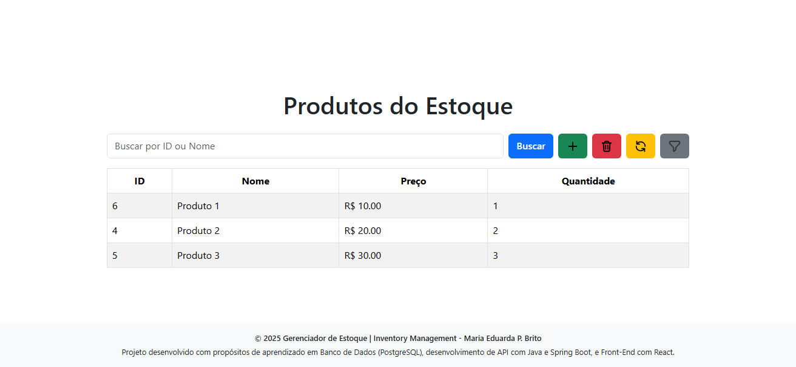

# 📦 Inventory Management Application System

A complete inventory product management system developed using:
- **Java** ☕ – Core programming language used for backend development.
- **Spring Boot** 🚀 – Framework for building the backend RESTful API quickly and efficiently.
- **Spring Data JPA** 📚 – Simplifies database interactions using JPA repositories.
- **React** ⚛️ – Frontend library for building a responsive and dynamic user interface.
- **Node.js** 🟢 – Runtime environment often used to support frontend tooling and development.
- **CSS3** 🎨 – Styling language to design the application layout and appearance.
- **JavaScript** 💻 – Scripting language to add interactivity on the frontend.
- **PostgreSQL** 🐘 – Relational database management system used to store product data.
- **Maven** 📦 – Build automation tool to manage dependencies and project lifecycle.

---

## How Java API with Spring Boot Works

### Architecture Overview
Spring Boot follows a **layered architecture** pattern that separates concerns and makes the application maintainable, testable, and scalable. The typical flow follows this pattern:

```
Client Request → Controller → Service → Repository → Database
                     ↓           ↓          ↓
                 HTTP Layer → Business Logic → Data Access Layer
```

### 1. **Controller Layer** (`@RestController`) 🎯
The controller layer handles HTTP requests and responses. It acts as the entry point for all API endpoints.

**Responsibilities:**
- Receive HTTP requests (GET, POST, PUT, DELETE).
- Validate request parameters and body.
- Call appropriate service methods.
- Return HTTP responses with proper status codes.
- Handle request mapping and routing.

**Example Structure:**
```java
@RestController
@RequestMapping("/products")
@CrossOrigin(origins = "http://localhost:3000")
public class ProductController {

    @Autowired
    private ProductService productService;

    @GetMapping
    public ResponseEntity<List<Product>> getAllProducts() {
        try {
            List<Product> products = productService.getAllProducts();
            return ResponseEntity.ok(products);
        } catch (Exception e) {
            System.err.println("Erro ao Buscar Produtos: " + e.getMessage());
            return ResponseEntity.internalServerError().build();
        }
    }
    @PostMapping
    public ResponseEntity<Product> createProduct(@RequestBody Product newProduct) {
        try {
            if (newProduct.getName() == null || newProduct.getName().trim().isEmpty()) {
                return ResponseEntity.badRequest().build();
            }

            Product savedProduct = productService.saveProduct(newProduct);
            return ResponseEntity.ok(savedProduct);
        } catch (Exception e) {
            System.err.println("Erro ao Criar Produto: " + e.getMessage());
            return ResponseEntity.internalServerError().build();
        }
    }

(...)
```

### 2. **Service Layer** (`@Service`) ⚙️
The service layer contains the business logic of the application. It processes data, applies business rules, and coordinates between different components.

**Responsibilities:**
- Implement business logic and rules.
- Data transformation and validation.
- Coordinate multiple repository calls if needed.
- Handle complex operations and workflows.
- Manage transactions.

**Example Structure:**
```java
@Service
public class ProductService {

  @Autowired
  private ProductRepository productRepository;

  public Product saveProduct(Product product) {
    try {
      return productRepository.save(product);
    } catch (Exception e) {
      System.err.println("Erro ao salvar produto: " + e.getMessage());
      throw new RuntimeException("Erro ao salvar produto");
    }
  }

  public List<Product> getAllProducts() {
    try {
      return productRepository.findAll();
    } catch (Exception e) {
      System.err.println("Erro ao buscar produtos: " + e.getMessage());
      throw new RuntimeException("Erro ao buscar produtos");
    }
  }

  public Product getProductById(Long id) {
    try {
      return productRepository.findById(id).orElse(null);
    } catch (Exception e) {
      System.err.println("Erro ao buscar produto ID " + id + ": " + e.getMessage());
      throw new RuntimeException("Erro ao buscar produto");
    }
  }

(...)
```

### 3. **Repository Layer** (`@Repository`) 🗃️
The repository layer handles data access operations. Spring Data JPA provides built-in methods and allows custom query definitions.

**Responsibilities:**
- Perform CRUD operations (Create, Read, Update, Delete)
- Execute custom database queries
- Handle database transactions
- Provide abstraction over database operations

**Example Structure:**
```java
@Repository
public interface ProductRepository extends JpaRepository<Product, Long> {

    List<Product> findByNameContainingIgnoreCase(String name);
    List<Product> findAllByOrderByQuantityAsc();

}
```

### 4. **Model/Entity Layer** (`@Entity`) 🧱
The model layer represents the data structure and maps to database tables using JPA annotations.

**Example Structure:**
```java
@Entity
public class Product {

    @Id
    @GeneratedValue(strategy = GenerationType.SEQUENCE, generator = "product_seq")
    @SequenceGenerator(name = "product_seq", sequenceName = "product_sequence", allocationSize = 1)

    private Long id;

    private String name;
    private int quantity;
    private double price;

    public Long getId() {return id;}
    public String getName() {return name;}
    public int getQuantity() {return quantity;}
    public double getPrice() {return price;}

    public void setId(Long id) {this.id = id;}
    public void setName(String name) {this.name = name;}
    public void setQuantity(int quantity) {this.quantity = quantity;}
    public void setPrice(double price) {this.price = price;}
}
}
```

### 5. **Database Integration** 🛢️
Spring Boot automatically configures the database connection using properties defined in `application.properties`:

```properties
# Database Configuration
spring.datasource.url=jdbc:postgresql://localhost:5432/Inventory
spring.datasource.username=${DB_USERNAME}
spring.datasource.password=${DB_PASSWORD}
spring.datasource.driver-class-name=org.postgresql.Driver

# JPA Configuration
spring.jpa.hibernate.ddl-auto=update
spring.jpa.show-sql=true
spring.jpa.properties.hibernate.dialect=org.hibernate.dialect.PostgreSQLDialect
spring.jpa.properties.hibernate.format_sql=true
```

### Request Flow Example 🔄
When a client makes a `GET /products` request:

1. **Controller** receives the HTTP request
2. **Controller** calls `productService.getAllProducts()`
3. **Service** applies any business logic (filtering, sorting, etc.)
4. **Service** calls `productRepository.findAll()`
5. **Repository** executes the database query
6. **Database** returns the product data
7. **Repository** converts database rows to Product objects
8. **Service** processes the data (if needed)
9. **Controller** wraps the data in an HTTP response
10. **Client** receives the JSON response

### Benefits of This Architecture 🎉

**Separation of Concerns:**
- Each layer has a specific responsibility
- Changes in one layer don't affect others
- Easier to test individual components

**Maintainability:**
- Code is organized and structured
- Easy to locate and modify specific functionality
- Clear dependencies between layers

**Scalability:**
- Each layer can be optimized independently
- Easy to add new features without breaking existing code
- Supports horizontal scaling patterns

**Testability:**
- Each layer can be unit tested in isolation
- Mock objects can be used to test individual components
- Integration tests can verify layer interactions

---

## Features ✨
### Main Screen
- Displays a table listing all products along with their details.
- Search bar for filtering by ID or Name.
- Action buttons: Add, Delete, Update, Sort.



### Models
- **Add Product:**
A form to enter product name, price, and quantity.
- **Delete Product:**
Input field for product ID with a confirmation step that shows a preview of the selected product.
- **Update Product:**
Interface allowing updates to name, price, or quantity, with a side-by-side comparison of current and new values.

---

## Tech Resources 🛠️
### Backend (Spring Boot & PostgreSQL)
- Layered Architecture (Controller → Service → Repository).
- Input validation.
- Exception handling.
- CORS configuration for frontend integration.
- PostgreSQL sequence generator for auto-incrementing IDs.

### Frontend (React)
- React Hooks: useState and useEffect.
- Responsive design with Bootstrap.
- Animated modals with fade-in and fade-out transitions.
- Real-time search functionality.
- Product preview before performing actions.

---

## Folder Structure (Basic) 📂
```
inventoryManagement/
├── backend/
│   ├── src/main/java/com/management/
│   │   ├── controller/
│   │   │   └── ProductController.java
│   │   ├── model/
│   │   │   └── Product.java
│   │   ├── repository/
│   │   │   └── ProductRepository.java
│   │   ├── service/
│   │   │   └── ProductService.java
│   │   └── InventoryManagementApplication.java
│   └── pom.xml
├── frontend/
│   ├── public/
│   │   ├── index.html/
│   ├── src/
│   │   ├── img/
│   │   ├── App.js
│   │   ├── App.css
│   │   └── index.js
│   └── package.json
└── README.md
```

## API Endpoints 🚪

| Method | Endpoint                          | Description                           |
|--------|---------------------------------|-------------------------------------|
| GET    | /products                       | Lists all products                   |
| POST   | /products                       | Adds a new product                   |
| GET    | /products/{id}                  | Retrieves a product by ID            |
| PUT    | /products/{id}                  | Updates a product                    |
| DELETE | /products/{id}                  | Deletes a product                    |
| GET    | /products/search?name={name}    | Searches for products by name        |
| GET    | /products/ordered-by-quantity   | Lists products ordered by quantity   |
| GET    | /products/exists/{id}           | Checks if a product exists by ID     |

---

# Running Locally 🏃‍♂️

Considering that you already have all the necessary tools installed to run this project locally (which are listed at the beginning of this file), follow the steps below to run the application on your machine:

## 1. Database Setup (PostgreSQL) 🐘
Before running the application, you need to set environment variables on your system so the backend can connect to the PostgreSQL database.

Make sure the database is created before running the application:

```sql
CREATE DATABASE Inventory;
```

The connection URL used in this project:
```properties
spring.datasource.url=jdbc:postgresql://localhost:5432/Inventory
```
> ⚠️ Make sure PostgreSQL is running and listening on port 5432.

### Required Environment Variables:
- **`DB_USERNAME`**: PostgreSQL database username.
- **`DB_PASSWORD`**: PostgreSQL database password.

These variables are automatically read from your environment by the application.properties file:

```properties
spring.datasource.username=${DB_USERNAME}
spring.datasource.password=${DB_PASSWORD}
```

**You can either:**
- Set them directly in the application.properties file (for testing only),
- Or define them as system environment variables via "Environment Variables" in System Properties or through the terminal/command line.

### How to Set Environment Variables on Windows:

```cmd
set DB_USERNAME=your_username
set DB_PASSWORD=your_password
```

## 2. Basic Commands ⚙️
### Backend
```bash
cd backend
./mvnw spring-boot:run
```

### Frontend
```bash
cd frontend
npm install
npm start
```

## Swagger Documentation (OpenAPI) 📄

The project provides automatic API documentation powered by Swagger (OpenAPI) for easy testing and exploration of all available endpoints.

### Access the API Documentation:
Simply open the following URL in your browser:
```
http://localhost:8080/swagger-ui.html
```
> Note: Ensure that the backend server is running before accessing this page.

### Features:
- Full list of available API endpoints.
- HTTP methods (GET, POST, PUT, DELETE) clearly displayed.
- Input and output data formats (JSON).
- Easy-to-use interface for testing endpoints directly from the browser.
- Automatic generation based on annotations in the code.

### Example:
- Through this interface, you can:
- Retrieve all products.
- Add, update, or delete products.
- Search for products by name or quantity.
